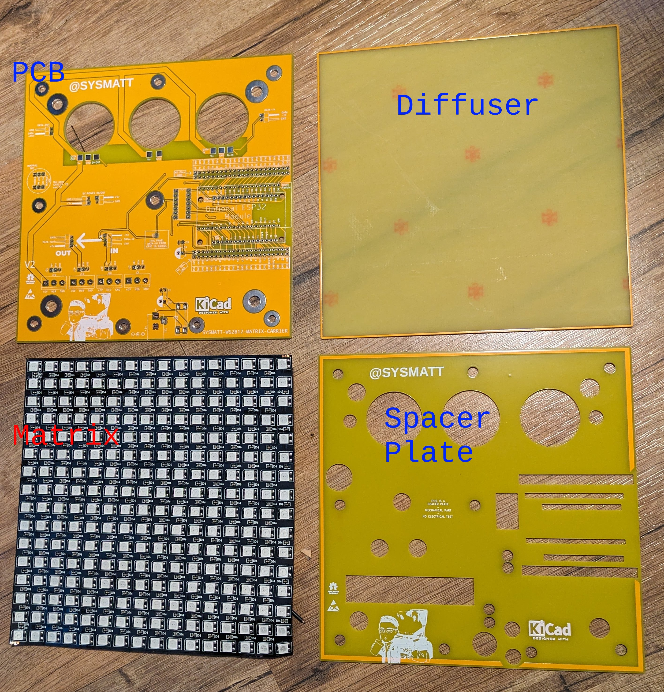
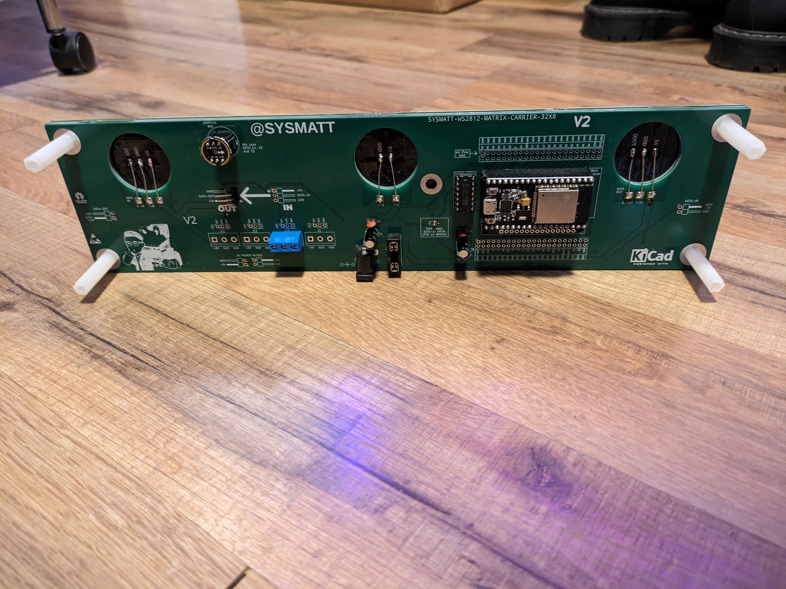

# SYSMATT-MATRIX-CARRIER
## An all-pcb combined ESB32 based WS2812B matrix carrier and diffuser.

###... It's a sandwich. 

These cheap pre-made WS2812B flexible matrix boards are plentiful and availible on Amazon/Aliexpress/etc.  

They look great through a 1mm FR4 PCB diffuser. 

In this repo is the carrier board I created to control them with the common 30pin or 38pin ESP32 WROOM modules.  

It supports WLED easily, and even has suport for audio reactive WLED using the common 6-pin INMP441 digital microphone modules.

The boards are assembled in a sandwich,  The main electronics PCB with the ESP module, Mic module, A SN74AHCT125N used as a voltage translator, and an assortment of connector options for input/output.

The boards can be assembled "smart" (With an ESP) ... or "dumb"... where it will be chained from a smart board. 

Four ESP outputs are voltage level translated in total to allow you to create large matrix displays. 

There is also a fuse.  Because house fires are no joke. 

I will add more here when I have time.  There are videos on the PHOTOS-VIDEOS directory.  Also on youtube:

Video link to YouTube:

https://youtube.com/shorts/75FGs6rpeio

https://youtube.com/shorts/8wDof0Con4Y

https://youtube.com/shorts/0d_V_7tXByc

https://www.youtube.com/watch?v=TLycWf7s_p8

I just use a couplle dots of silicone to hold the sandwitch together 

